# ModelCanvas

[中文文档](./README.zh-CN.md)

ModelCanvas is a protocol-driven rendering bridge for rich model output. A model or tool emits a versioned `RenderEnvelope`; the host validates it, resolves a compatible renderer, and renders it inside an appropriate trust boundary.


## Rendered case gallery

These are screenshots from the running ModelCanvas frontend—not design mockups. Every case is backed by a validated fixture, and sample data is visibly labeled. Run the app and append `&case=1` to any scenario URL for the focused, ChatGPT-style result view.

### All 50 RenderEnvelope types

<details open>
<summary><strong>Controlled business widgets</strong></summary>
<table>
  <tr><td width="50%"><br><code>widget.weather</code></td><td width="50%"><br><code>widget.stock</code></td></tr>
  <tr><td><br><code>widget.sports</code></td><td><br><code>widget.travel</code></td></tr>
  <tr><td><br><code>widget.product</code></td><td><br><code>widget.calendar</code></td></tr>
  <tr><td><br><code>widget.email</code></td><td><br><code>widget.logistics</code></td></tr>
</table>
</details>

<details open>
<summary><strong>Text, structured data, charts and diagrams</strong></summary>
<table>
  <tr><td width="50%"><br><code>text.markdown</code></td><td width="50%"><br><code>text.code</code></td></tr>
  <tr><td><br><code>text.math</code></td><td><br><code>data.table</code></td></tr>
  <tr><td><br><code>data.json</code></td><td><br><code>chart.echarts</code></td></tr>
  <tr><td><br><code>chart.vega-lite</code></td><td><br><code>diagram.mermaid</code></td></tr>
  <tr><td><br><code>diagram.excalidraw</code></td><td></td></tr>
</table>
</details>

<details>
<summary><strong>Media and documents</strong></summary>
<table>
  <tr><td width="50%"><br><code>media.image</code></td><td width="50%"><br><code>media.audio</code></td></tr>
  <tr><td><br><code>media.video</code></td><td><br><code>audio.pronunciation</code></td></tr>
  <tr><td><br><code>document.pdf</code></td><td><br><code>document.docx</code></td></tr>
  <tr><td><br><code>document.spreadsheet</code></td><td><br><code>document.presentation</code></td></tr>
  <tr><td><br><code>document.epub</code></td><td></td></tr>
</table>
</details>

<details>
<summary><strong>Notebook, spatial and open-ended artifacts</strong></summary>
<table>
  <tr><td width="50%"><br><code>data.notebook</code></td><td width="50%"><br><code>data.parquet</code></td></tr>
  <tr><td><br><code>map.geo</code></td><td><br><code>model.3d</code></td></tr>
  <tr><td><br><code>artifact.html</code></td><td><br><code>artifact.react</code></td></tr>
  <tr><td><br><code>artifact.python</code></td><td><br><code>form.dynamic</code></td></tr>
</table>
</details>

<details open>
<summary><strong>Professional technical rendering · Math, Maps, Science and Engineering</strong></summary>

| Family      | Representative types                              | Why these were selected                                                                |
| ----------- | ------------------------------------------------- | -------------------------------------------------------------------------------------- |
| Math        | plot, geometry, matrix, distribution, number-line | Covers coordinates, constraints, linear algebra, probability and elementary reasoning. |
| Maps        | places, route, heatmap, track                     | Reuses one geographic interaction model for the most common location and path tasks.   |
| Science     | molecule, reaction, optics                        | Represents structure, transformation and ray-based scientific explanation.             |
| Engineering | circuit, waveform, timing, logic                  | Covers physical connectivity, sampled signals and digital-system behavior.             |

<table>
  <tr><td width="50%">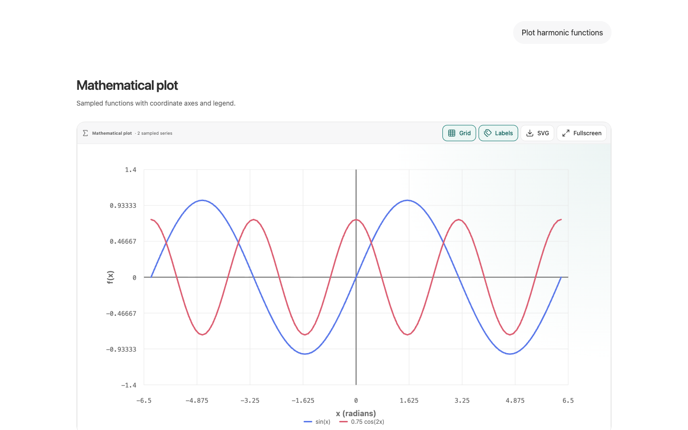<br><code>math.plot</code></td><td width="50%">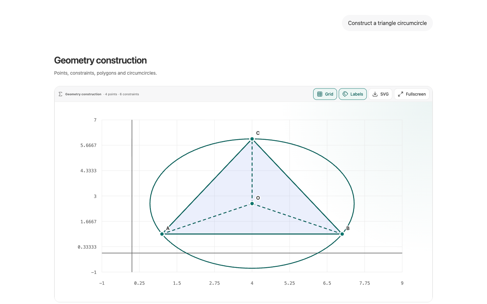<br><code>math.geometry</code></td></tr>
  <tr><td>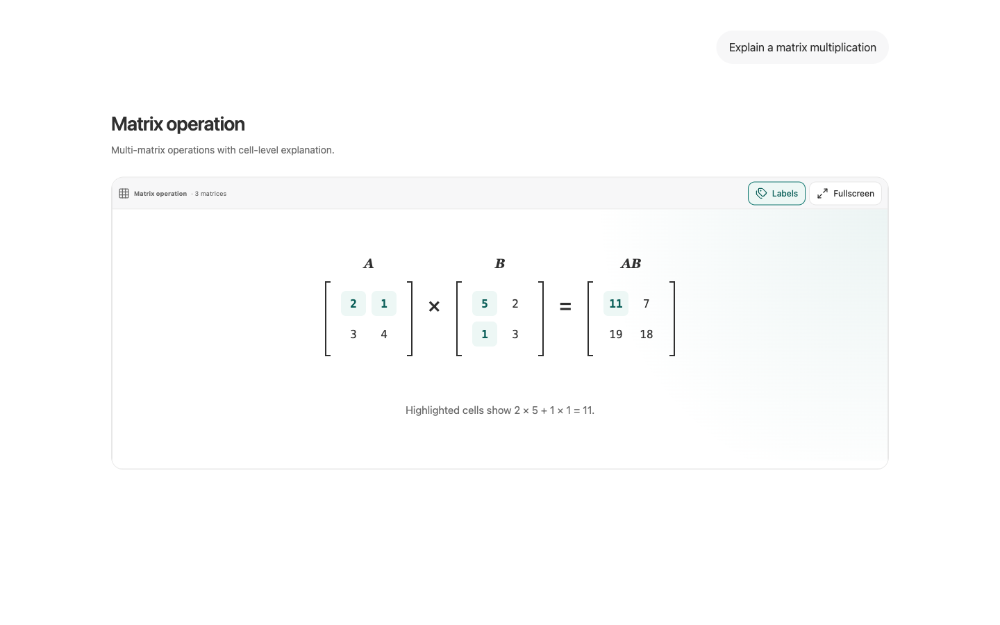<br><code>math.matrix</code></td><td>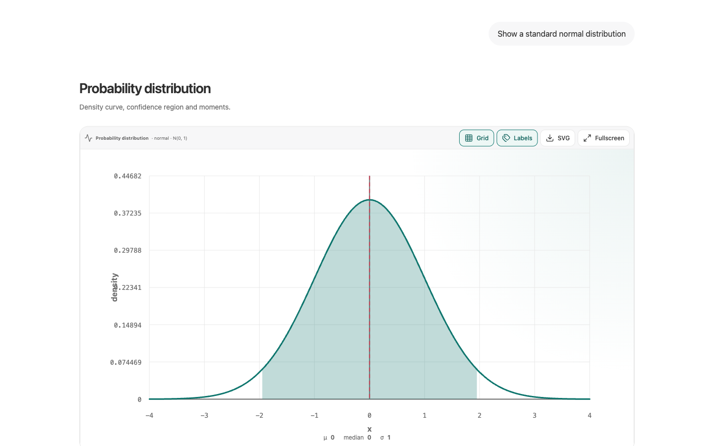<br><code>math.distribution</code></td></tr>
  <tr><td>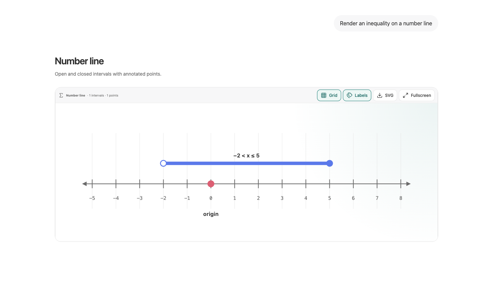<br><code>math.number-line</code></td><td>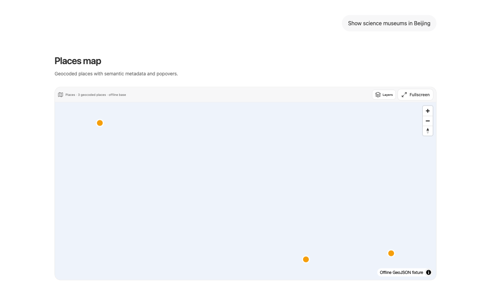<br><code>map.places</code></td></tr>
  <tr><td>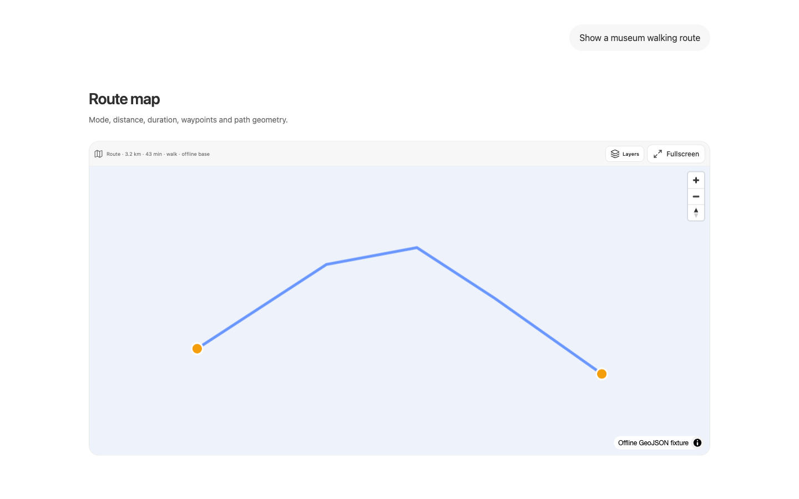<br><code>map.route</code></td><td>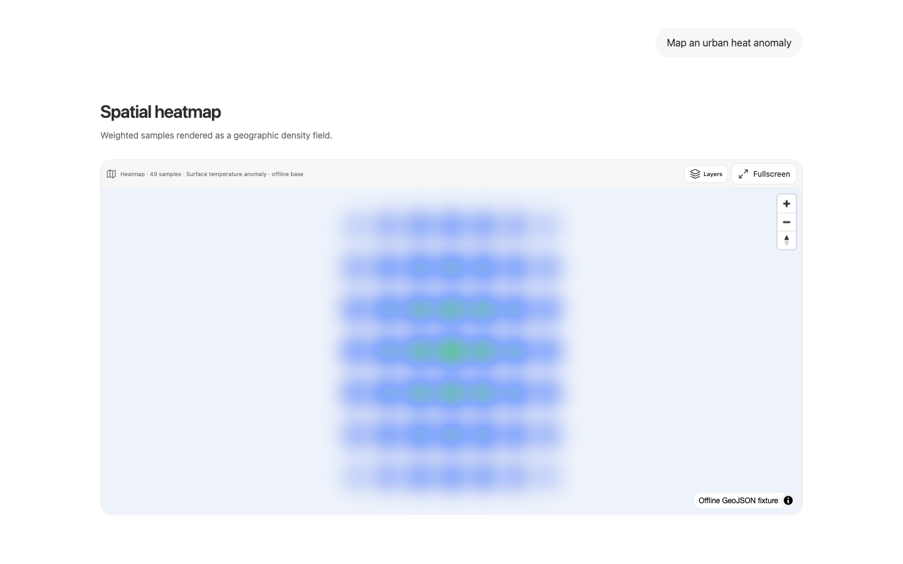<br><code>map.heatmap</code></td></tr>
  <tr><td>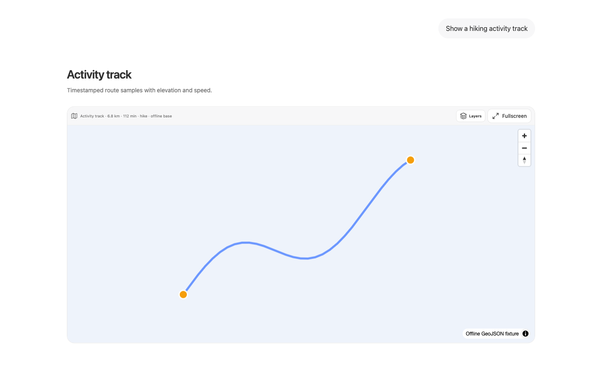<br><code>map.track</code></td><td>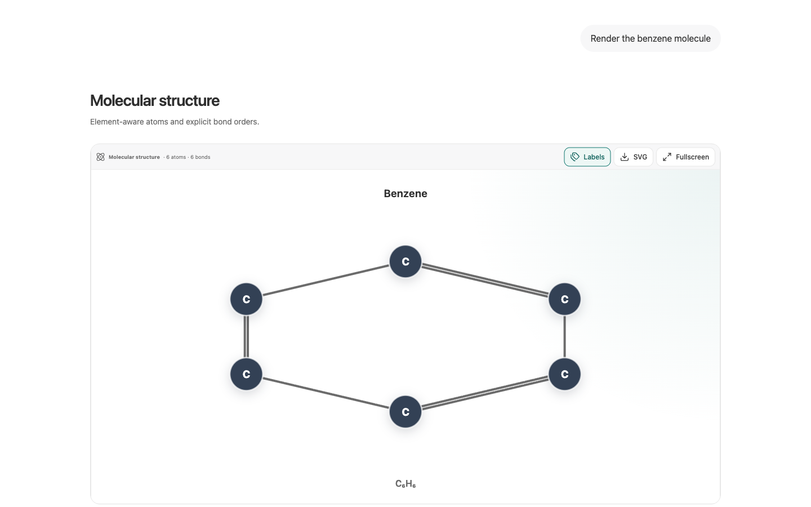<br><code>science.molecule</code></td></tr>
  <tr><td>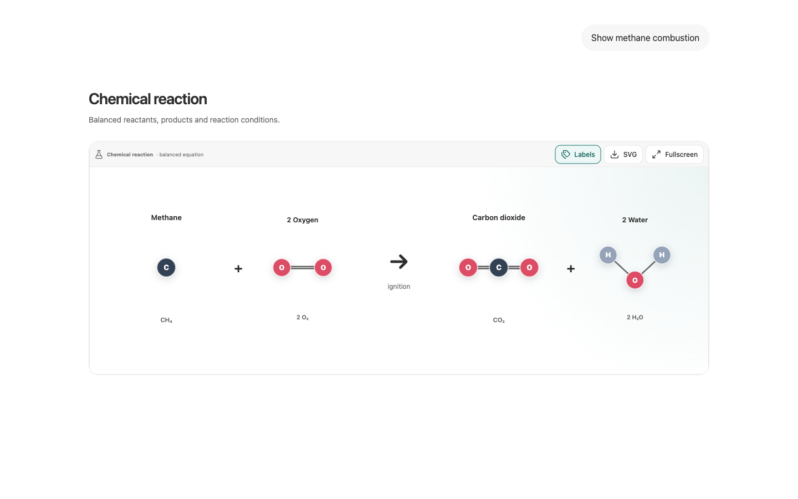<br><code>science.reaction</code></td><td>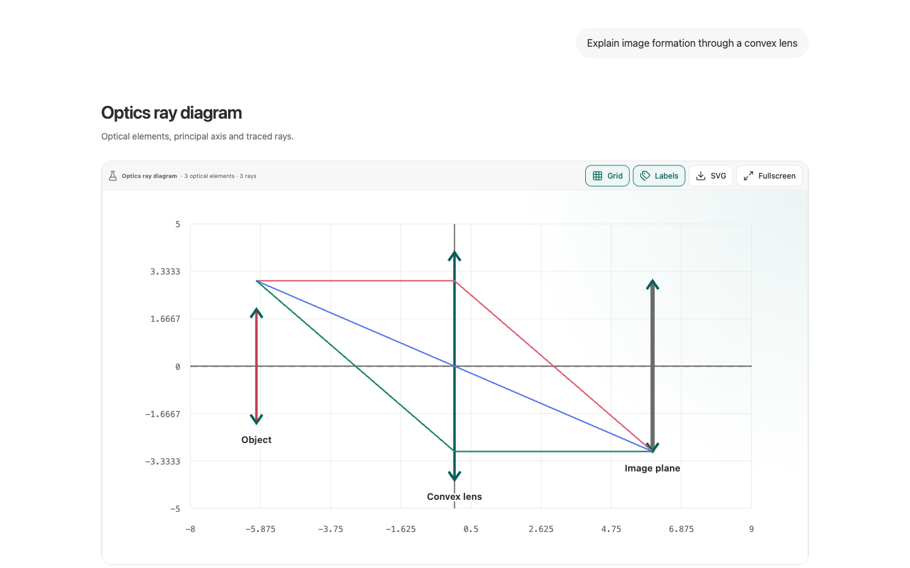<br><code>science.optics</code></td></tr>
  <tr><td>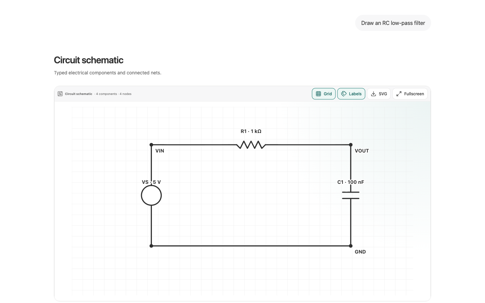<br><code>engineering.circuit</code></td><td>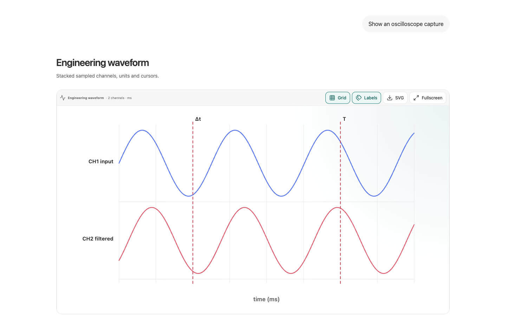<br><code>engineering.waveform</code></td></tr>
  <tr><td>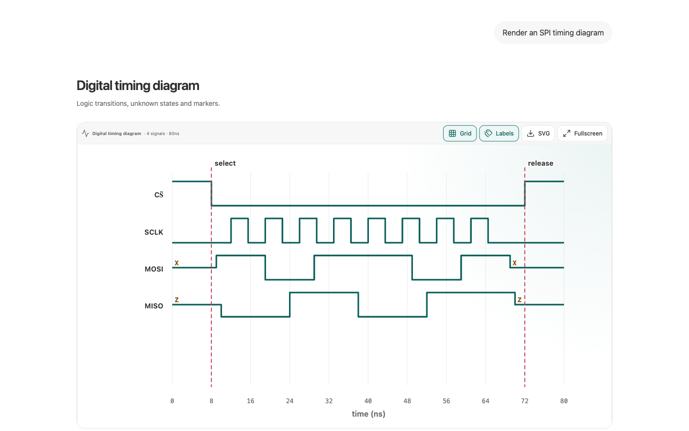<br><code>engineering.timing</code></td><td>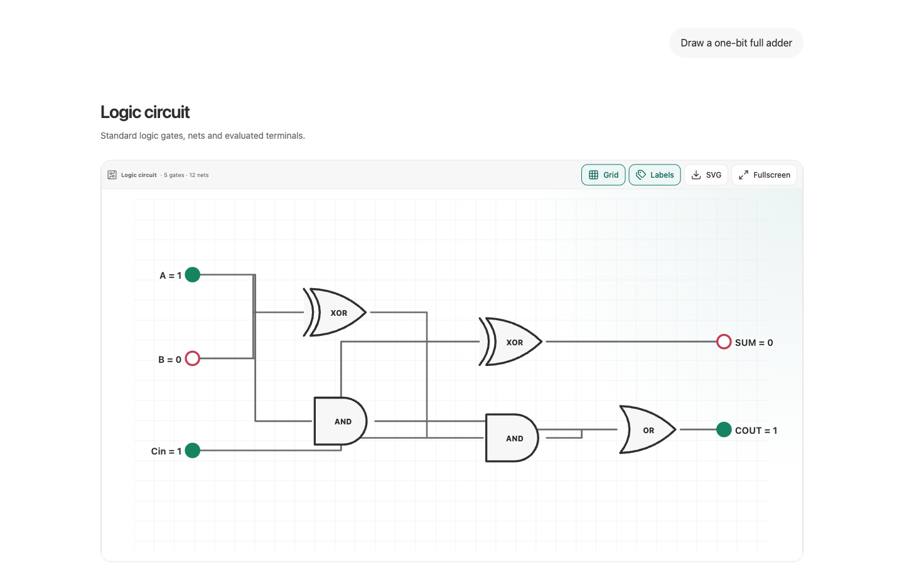<br><code>engineering.logic</code></td></tr>
</table>
</details>

## What is included

- Three output paths: controlled widgets, declarative renderer catalog, and sandboxed open artifacts.
- 50 exact Zod envelope variants and a registry with version, MIME, extension, priority, override, lazy-load, and fallback support.
- 55 deterministic offline scenarios covering all 50 protocol variants across text, charts, diagrams, data, media, documents, professional technical graphics, maps, 3D, forms, widgets, and code artifacts.
- A unified Technical category for sampled math plots, geometry, matrices, probability, number lines, semantic maps, molecules, reactions, optics, circuit schematics, engineering waveforms, timing diagrams, and logic circuits.
- A self-hosted React/TypeScript artifact runtime that compiles in an opaque, network-disabled iframe without a remote bundler.
- Playground, protocol inspector, and renderer gallery.
- MCP Apps, AG-UI, A2UI, OpenAI Apps, and Vercel AI SDK adapters.
- OpenAI-compatible and Anthropic provider interfaces with server-only credentials.
- Browser-native PDF/DOCX/XLSX/EPUB previews and an optional hardened LibreOffice conversion service.
- Vitest, Testing Library, Playwright, axe, CI, and generated real fixture files.

## Quick start

Requires Node.js 22.13+ (Node 24 recommended).

```bash
npm ci
npm run dev
```

Open `http://localhost:3000`. Fixture mode works without credentials or network calls.

```bash
npm run typecheck
npm run lint -- --quiet
npm test
npm run test:e2e -- --project=chromium
npm run build
```

To enable presentation conversion:

```bash
docker compose up --build office-converter
cp .env.example .env.local
```

## Minimal envelope

```json
{
  "id": "hello",
  "type": "text.markdown",
  "version": "1.0.0",
  "payload": {
    "content": "# Hello ModelCanvas",
    "streaming": false
  }
}
```

See [protocol](docs/protocol.md), [architecture](docs/architecture.md), [renderer development](docs/renderer-development.md), [integrations](docs/integrations.md), [security](docs/security.md), and [deployment](docs/deployment.md).

## Important boundaries

- Demo data is explicitly labeled and deterministic.
- HTML and React run in sandboxed iframes without same-origin access; React uses a self-hosted TypeScript compiler and an offline dependency allowlist; Python runs in a terminable Worker.
- Unknown or invalid output never masquerades as a successful rich render.
- Provider keys remain server-side. Do not place secrets in any `NEXT_PUBLIC_*` variable.

Licensed under MIT. Third-party dependencies retain their respective licenses; see [references](docs/references.md).
