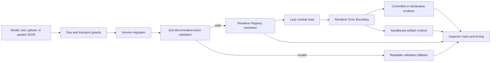

# ModelCanvas Implementation Plan

> Status: active implementation plan. Items are checked only after executable validation; this file is not a completion claim.

## 1. Product understanding

ModelCanvas is a provider-neutral rendering bridge for rich model output. It must accept untrusted model/tool data, validate and normalize it into a versioned `RenderEnvelope`, resolve a lazy renderer through a capability-aware registry, isolate failures or executable artifacts, and expose the complete decision path in a production-quality Playground and Protocol Inspector.

The product covers three deliberately different trust paths:

1. **Controlled rendering** — trusted, pre-registered React renderers receive exact, validated payloads. This is the default path.
2. **Declarative rendering** — the model may compose only an allow-listed component catalog. Nested layouts, streamed property patches, and component events stay data-only.
3. **Open-ended artifacts** — HTML, React, and Python run outside the host execution context with explicit lifecycle controls, time limits, network/dependency policy, and visible trust labels.

Every required demo must work without a commercial API key. Fixture mode is always labeled as sample data. Real providers are optional adapters and their secrets remain server-only.

## 2. Repository assessment and architecture decision

The workspace was empty and not a Git repository. It was initialized with the available Cloudflare-compatible vinext starter, which supplies React 19, Next App Router compatibility, Tailwind 4, a Vite build, a Cloudflare Worker entry point, and Sites deployment metadata. The starter has no valuable product code, persistence requirement, or existing visual system.

The implementation uses one deployable application with package-style source boundaries rather than independently published workspace packages. This avoids duplicating React and heavyweight browser dependencies while preserving the requested public boundaries:

```text
app/                         routes and server endpoints
src/
  core/                      envelope parsing, migrations, registry, events
  schema/                    exact Zod payload schemas and JSON Schema export
  react/                     host, boundaries, shell, declarative catalog
  providers/                 demo/OpenAI/Anthropic/OpenAI-compatible/TTS
  security/                  URL/file/HTML/SVG/artifact policy
  adapters/                  MCP Apps, AG-UI, A2UI, OpenAI Apps, Vercel AI SDK
  renderers/                 lazy renderer modules grouped by capability
  widgets/                   business widgets and schemas
  fixtures/                  deterministic offline scenarios and sample assets
  test-utils/                typed builders and DOM helpers
services/office-converter/   isolated LibreOffice conversion service
docs/                        protocol, architecture, security, validation
tests/                       unit, component, E2E, visual
```

Boundaries are enforced with TypeScript aliases and narrow exports. Renderer modules never import provider secrets; providers never own view code; unsafe payloads never reach renderer modules.

## 3. End-to-end data flow



## 4. Core design

### RenderEnvelope and schema

- Version `1.0.0` is the canonical wire version.
- A Zod discriminated union defines every required render type with an exact payload; shared envelope fields are composed around that union.
- Parsing returns structured issues with precise JSON paths and never throws across the UI boundary.
- Migration is a pure, tested pipeline. Initial support migrates legacy `0.1`/`v1` aliases and records migrations in inspector metadata.
- Unknown types use an explicitly typed fallback envelope retaining safe text, markdown, image, or download alternatives.
- JSON Schema is generated from the same source and committed/exported for server and client consumers.
- Serialization rejects non-JSON values, excessive depth, and excessive byte size.

### Renderer Registry

- Dynamic `register`, `unregister`, `resolve`, `resolveByMime`, and `resolveByExtension` APIs.
- Resolution considers exact type, compatible semantic version, priority, and capability requirements.
- Modules use dynamic imports and a cached promise per definition.
- Module load/render errors are isolated and traced; the next compatible renderer or fallback is attempted.
- Manifest export is serializable and excludes executable module loaders.
- Debug traces are development-only and never expose secrets.

### Provider abstraction

- `ModelProvider` supports streaming text/envelope events and advertises tools, structured output, and audio capability.
- Adapters: local deterministic demo, OpenAI, Anthropic, and OpenAI-compatible.
- `/api/model` and `/api/tts` read secrets only in the server/worker environment.
- TTS uses OpenAI when configured and Browser SpeechSynthesis as the visible fallback. Cache keys are deterministic hashes of provider, voice, speed, format, and text.

### Rendering strategy

- Lightweight content renderers ship in the main route only when needed; heavyweight modules are lazy imports.
- Large data uses pagination/virtual windows, byte/row/depth guards, and Web Workers where execution is substantial.
- HTML uses an iframe without `allow-same-origin`, a generated CSP, no network by default, a watchdog, revokeable Blob URLs, console forwarding, stop, and reset.
- React runs in a dependency-allow-listed sandbox runtime.
- Python runs in a terminable Worker backed by Pyodide and exposes stdout, errors, tables, and images.
- PDF, Office, EPUB, Notebook, maps, 3D, charts, diagrams, media, and drawings each release their resources during unmount.

## 5. Product surfaces

### Playground (`/`)

- Three-pane desktop layout: scenario/history navigation, conversational input, artifact panel; inspector is a resizable lower drawer.
- Compact mobile layout with accessible tabs and a persistent composer.
- Natural-language fixture routing, provider selection, file upload, envelope paste, renderer override, raw JSON/schema/result/fallback views, theme, fullscreen, export/share configuration, and clear session.
- Deterministic built-in scenarios for all 25 requested demonstrations.

### Component Gallery (`/gallery`)

- Searchable/filterable renderer and widget catalog.
- Every business widget exposes loading, empty, error, compact, full, light, and dark examples.
- Capability and trust badges reflect the registry manifest.

### Protocol Inspector (`/inspector`)

- Editable/pasteable raw envelope, validation issues, selected renderer, capabilities, migration steps, timing, errors, and fallback path.
- Useful invalid and dangerous payload presets.

## 6. Functional implementation slices

1. **Foundation** — schemas, migration, registry, renderer host, error boundary, security guards, fixtures, shell, CI.
2. **Core content** — streaming Markdown, code/diff/editor, math, JSON/YAML/XML/logs, data table, ECharts, Vega-Lite, Mermaid.
3. **Media** — image comparison, audio/waveform, pronunciation/TTS, video/transcript.
4. **Documents/data** — PDF, DOCX, spreadsheet, presentation/converter, EPUB, Notebook, Parquet/Arrow.
5. **Open artifacts and spatial** — HTML, React, Python, Excalidraw, MapLibre, Three.js.
6. **Controlled business UI** — weather, stock, sports, travel, product, calendar, email, logistics, dynamic form.
7. **Protocol compatibility** — real conversion functions, fixtures, failures, and tests for MCP Apps, AG-UI, A2UI, OpenAI Apps, and Vercel AI SDK.
8. **Hardening** — unit/component/E2E/visual tests, accessibility, responsive QA, bundle review, docs, clean install validation.

## 7. Technical choices

| Concern | Choice | Reason / fallback |
|---|---|---|
| Runtime | React 19 + vinext/Next-compatible App Router + Cloudflare Worker | Existing supported deployment scaffold; route-local client boundaries |
| Styling | Tailwind CSS 4 plus semantic CSS variables | Small design-system surface, responsive and themeable |
| Validation | Zod 4 + JSON Schema export | One source for runtime types, error paths, and protocol schema |
| Markdown | `react-markdown`, GFM, math, KaTeX, sanitization, custom fenced renderers | Streaming-safe; incomplete blocks degrade to literal code |
| Code | Shiki-compatible highlighting; Monaco lazy edit mode | Static path remains fast if editor cannot load |
| Charts | ECharts and Vega-Lite lazy client modules | Coexistence and export; option/spec sanitizers run first |
| Diagrams | Mermaid strict mode; Excalidraw lazy module | SVG/PNG export and visible parse errors |
| Table | TanStack Table + windowed rows | Typed controls and large-data protection |
| Media | native media plus Wavesurfer | Native fallback is always retained |
| Documents | PDF.js, docx preview, SheetJS, epub.js; LibreOffice conversion service | Service failure exposes download/fallback, never fake preview |
| Artifacts | sandbox iframe, Sandpack, Pyodide Worker | Stop/reset controls and isolated errors |
| Spatial | MapLibre GL and Three.js | No injected style scripts; explicit disposal |
| Tests | Vitest, Testing Library, axe, Playwright | Unit through E2E and stable visual fixtures |

Dependencies are pinned through the existing lockfile after checking current official maintenance, license, browser-only loading requirements, and SSR behavior. Reference code is not copied.

## 8. Security model

- Trust nothing from a model, tool, URL, or uploaded file before validation.
- Reject `javascript:`, dangerous data URLs, non-allow-listed remote origins, oversized payloads, excessive JSON depth, unsafe filenames, and MIME/extension mismatches.
- Sanitize Markdown HTML, HTML fragments, and SVG separately with restrictive profiles.
- Strip all ECharts function-valued formatters and disallow executable Vega transforms/data URLs unless trusted policy permits them.
- Mermaid uses strict security and disabled HTML labels.
- Artifact CSP defaults to `default-src 'none'`; network access is opt-in and origin-scoped.
- Never give untrusted iframes `allow-same-origin`; never run generated code in the host window.
- Require visible confirmation for email, deletion, payment/order, calendar mutation, sensitive upload, and every external write action.
- Redact secrets in provider errors and telemetry. Fixture data is synthetic and visibly labeled.

## 9. Performance and accessibility

- Lazy renderer boundaries and route splitting keep heavy libraries out of first paint.
- AbortControllers stop provider streams and file loads; Workers/iframes can be terminated.
- Virtual windows, pagination, and preview limits protect large tables/files.
- Blob URLs, Workers, audio contexts, media listeners, chart instances, PDF tasks, WebGL materials/geometries/textures, and map instances are released on unmount.
- Controls have accessible names, visible focus, correct roles, reduced-motion support, keyboard alternatives, and sufficient contrast.
- Desktop, tablet, and mobile layouts are verified at deterministic viewports.

## 10. Risks and degradation strategy

| Risk | Mitigation / honest degradation |
|---|---|
| Heavy renderer packages exceed bundle or Worker limits | Lazy import; explicit size guard; basic/native renderer remains available |
| Office fidelity differs by browser | Use browser preview for basic content and the isolated LibreOffice-to-PDF service for fidelity |
| Browser lacks a codec, WebGL, speech, or Worker feature | Detect capability, explain it, offer transcript/raw/download; never show false success |
| Remote tiles/assets violate network-default policy | Offline/simple basemap fixture or user-enabled allow-listed origin with attribution |
| Pyodide startup is slow or unsupported | Progress, cancellable Worker, explicit unsupported error, code/output fixture remains labeled |
| Sandbox cannot enforce byte/CPU quota perfectly in browser | Payload limits, watchdog termination, Worker/iframe replacement, no host privileges |
| Real provider credentials are absent | Deterministic fixture provider and Browser SpeechSynthesis fallback, clearly labeled |
| Conversion service is unavailable | Explain service state, show source metadata/download, preserve retry; never pretend conversion happened |
| Third-party API/spec evolves | Narrow adapters, version tags, fixture tests, unknown-event fallback |

## 11. Implementation order

1. Commit this plan before product code.
2. Add scripts/dependencies and strict project configuration.
3. Implement schema/security/registry/providers/adapters with unit tests.
4. Replace starter shell and implement Playground/Inspector/Gallery.
5. Add renderer families and deterministic fixtures in capability-sized batches.
6. Add widgets and confirmed-action interaction model.
7. Add document conversion service, env template, and Docker Compose.
8. Add E2E/visual/accessibility suites, CI, protocol/security/architecture docs, and bilingual README.
9. Run static, build/interaction, and clean-environment validation; record only observed outcomes.

## 12. Complete acceptance checklist

### Foundation and protocol

- [ ] Clean install and development server start
- [ ] Production build, strict typecheck, lint, format check
- [ ] Versioned exact `RenderEnvelope` discriminated union for every type
- [ ] Field-path validation errors, server/client validation, serialization tests
- [ ] JSON Schema export, examples, unknown-type fallback, version migration
- [ ] Registry register/unregister/type/MIME/extension/priority/version/capability resolution
- [ ] Lazy modules, load-error isolation, manifest, debug trace, fallback renderer
- [ ] Controlled, declarative, and open-ended trust paths
- [ ] Model providers: demo, OpenAI, Anthropic, OpenAI-compatible
- [ ] No-key fixture mode, `.env.example`, server-only keys, honest provider errors

### Renderers

- [ ] Streaming Markdown (GFM, tables, tasks, code, math, Mermaid, sanitization, links/images, footnotes, copy)
- [ ] Code (highlight, lines, copy, wrap, collapse, filename, diff, search, fullscreen, download, large-file guard, Monaco edit)
- [ ] Math (inline/block/matrix/aligned/error/fallback)
- [ ] JSON/YAML/XML/logs (tree/raw, fold, search, path, validation, filters, guards)
- [ ] Table (CSV/TSV, sort/filter/search/page/window/sticky/columns/types/format/export/chart/selection stats)
- [ ] ECharts required chart families, interaction, export, data-only option validation
- [ ] Vega-Lite validation, responsive view, trusted data policy, export, error path
- [ ] Mermaid requested families, themes, zoom/pan, export, strict security, parse errors
- [ ] Excalidraw view/edit/fullscreen/export/save/error
- [ ] Image formats/sources/transform/fullscreen/download/metadata/SVG sanitization/fallback/compare/overlay
- [ ] Audio native/waveform/controls/speed/transcript/regions/error/fallback/cleanup
- [ ] Pronunciation fields, accent/speed/regenerate, word/example audio, provider/fallback/cache/retry/limits
- [ ] Video controls/subtitles/poster/chapters/fullscreen/download/transcript/seek/error
- [ ] PDF pagination/zoom/search/jump/thumbnails/fullscreen/download/text/progress/guards/errors
- [ ] DOCX upload/URL/blob/styles/tables/images/reading/download/fallback/conversion option
- [ ] Spreadsheet XLSX/XLS/CSV/multi-sheet/formats/freeze/search/formulas/sizes/download/chart
- [ ] Presentation/Office browser preview or real LibreOffice-to-PDF service with limits/isolation/timeout/cleanup
- [ ] EPUB TOC/chapter/font/theme/progress/download
- [ ] Notebook Markdown/code/stream/error/image/safe HTML/MIME/fold/raw
- [ ] Parquet/Arrow metadata/schema/rows/columns/preview/page-or-worker/table/chart/guards
- [ ] Map GeoJSON/marker/popup/line/polygon/route/heatmap/cluster/bounds/layers/fullscreen/errors
- [ ] 3D GLTF/GLB/OBJ/STL/PLY/camera/orbit/light/background/wireframe/info/progress/fullscreen/disposal/errors
- [ ] HTML Artifact sandbox/CSP/no-parent/no-network/allowlist/code-preview/reset/stop/fullscreen/download/console
- [ ] React Artifact multifile/React/TS/CSS/errors/console/code-preview/refresh/reset/fullscreen/export/allowlist/timeout
- [ ] Python Artifact Worker/code/stdout/stderr/NumPy/pandas/Matplotlib/table/image/timeout/reset/rerun/package policy/status
- [ ] Dynamic form catalog with fields/groups/wizard/validation/submit/cancel/confirmation/events

### Widgets and Playground

- [ ] Weather, stock, sports, travel, product, calendar, email, logistics schemas and real fixtures
- [ ] Every widget has loading/empty/error/compact/full/light/dark/responsive/a11y/gallery states
- [ ] Required weather and stock provider/data fields
- [ ] Confirmations for calendar/email and all external writes
- [ ] Natural-language input, provider selection, upload, envelope paste, renderer override
- [ ] JSON/schema/result/fallback/trace inspection, fullscreen, themes, mobile, export/share, clear session
- [ ] All 25 named demo scenarios work offline with explicit sample-data labels

### Adapters, security, testing, and delivery

- [ ] MCP Apps, AG-UI, A2UI, OpenAI Apps, Vercel AI SDK conversions with types/fixtures/tests/docs/errors
- [ ] URL/file/filename/MIME/depth/size/HTML/SVG/chart/diagram guards
- [ ] iframe sandbox/CSP/origin policy/watchdog/Worker termination/object URL and resource cleanup
- [ ] Unit tests for schemas, registry, migrations, adapters, security, widgets, providers, TTS cache
- [ ] Component tests for loading/empty/error/invalid/theme/keyboard/boundary/copy/download/fullscreen
- [ ] 20 required E2E flows and ten stable visual baselines
- [ ] English and Chinese README with reciprocal links and all requested sections
- [ ] Architecture, protocol, security, capability matrix, references, and truthful validation docs
- [ ] CI frozen install/lint/format/typecheck/unit/build/E2E/cache/failure artifacts
- [ ] Three observed validation rounds recorded with versions, counts, fixes, limits, and failures
- [ ] No hard-coded secrets, fake success, disabled core tests, empty renderer, or undisclosed severe error

